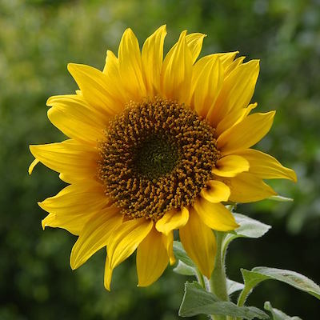
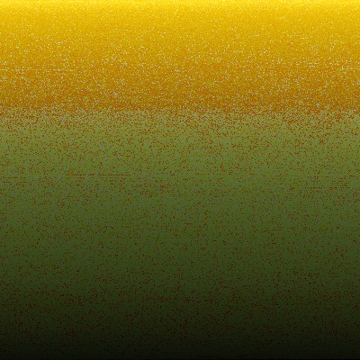
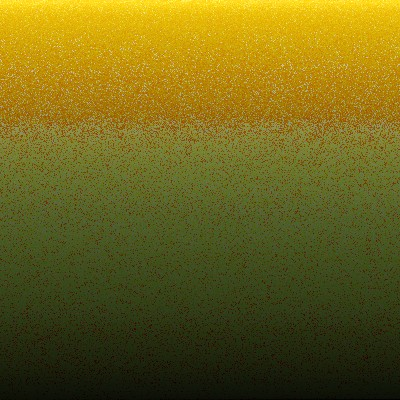

Pixel Sorting
============

A set of pixel sorting visualization using different methods on Processing.
This is my attempt to learn those sorting algorithm, but with something aesthetically pleasing. Those sketches with "Simple" on its name are the 1st attempt to understand the pixel sorting process and don't have or have limited visualization.
Since we are talking about sorting pixels, there are lots of ways in doing that:
- you can sort by hue, brightness, by the colour channel, saturation (HSB colour mode). So far I only did for hue and brightness.
- you can sort just like above and with any sorting method, but instead of sorting all the pixels of the images, sort line by line separated, either horizontally or vertically or a combination of those. This is the simpler version, sorted the whole pixels.

\- \- \-

#### Basic setup and config
Most of the processing sketches have the following variables to control the visualization and sorting.

* boolean showBothIMG -> can be either "true" or "false"; If true, it shows both imgs side by side, otherwise it only shows the sorted img with the original image in the corner reduced to 20% the size. If the image is bigger than the device's screen, it will rescale the image to 80% of the screen.
* String sortPixelMethod -> can be either "hue" or "brightness". As the name sugests the user can select how to sort the pixels by hue or brightness
* int multiStep -> each sorter has its own value. This is used to control speed of sorting process. For each frame, the process will run a  multiStep times.

\- \- \-

Bellow there are the links of video examples for each visualizations method (GIF images were too big to put here). It also mentions if that sorting method is stable or not. Stable sort algorithms sort repeated elements in the same order that they appear in the input. We can actually see the differences between a stable sorting and an unstable just by see the pixels arrangement. This is evident on the images on the bottom of the page.

|  *Simple sort* |
|     :---:      |

#### Pixel Bubble Sorting
Stable: Yes

#### Pixel Insertion Sorting
Stable: Yes

#### Pixel Selection Sorting
Stable: No

| *Efficient sort* |
|      :---:       |

#### Pixel Shell Sorting
Stable: No

#### Pixel Quick Sorting
Stable: No (I know there are stable versions, but not this one)

#### Pixel Merge Sorting
Stable: Yes

#### Pixel Heap Sorting
Stable: No

#### Pixel Counting Sorting
Stable: Yes

#### Pixel Radix LSD (least significant digit) Sorting
Stable: Yes

\- \- \-

\[ Visualizing a stable sort against an unstable \]

If you check the pixels sorted by a stable algorithm for the same image, they will be the same. The same image sorted by an unstable algorithm will result in different configurations. Check below the sunflower image sorted by brightness using the insertion and merge methods. They are the same:

Now compare the same image sorted respectively by quicksort and shellsort:

You can see that the image from quicksort and shellsort are different from the stable sorters and also different from each other.

                   __________________________
                  /                           \
                 |I hope this was interesting. |
                 \__   __ __ __ __ __ __ __ __/
                    | /
             __w    |/
     (\{\  ,%%%%            .-.   __
     { { \.%%%_/   ,_*   _ /   \ /  \
     { {  \%%/(___//    / \|   |/   |
     { {\,%%%|[))-'    :   \   /  _/_
     {/{/\,%%)\(       _\_  \_|_.'   '.
           '%]\\      :   '-(  )_____.'
             ((']       '.__/'--\   \
              \yI\         /  |  \   )
             (/  (\       /   /  |'-:
             7    k\      '--'\__/ \ \
            J'    `L_               \ \
                                     \ \
\- \- \-

\[ all code available under MIT License - feel free to use. \]
